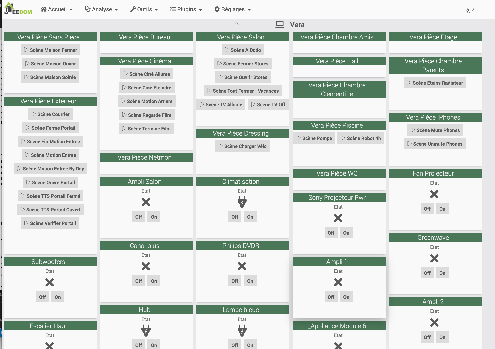

# Plugin Jeedom pour controler une Vera ( Ezlo, anciennement Micasaverde )

Ce plugin permet de detecter les pieces et les scenes d'un controlleur **Vera** et de rendre accessible depuis **Jeedom**. il permet de lancer l'execution des scenes a distance sur la vera.

## Utilisation
Le plugin permet de declarer une vera par son addresse IP ce qui creer un equipement de type 'racine'.
- Les pieces de la vera seront detectees et proposees comme un autre equipement dans jeedom. l'utilisateur pourra choisir quels equipements ( les pieces ) il active et rend visibles dans jeedom.

- Si la piece de la vera comporte une scene,  une action est cree sur l'equipement piece. cette action permet de declencher la scene sur la vera.

Les equipements de type pieces, suivront toujours l'equipement racine ( la vera ). 
* Si l'equipement vera est detruit, les pieces associees seronts detruites.
* si l'equipement vera est deplacé dans un autre objet parent jeedom, les pieces seront deplacees dans le meme objet parent.
* la liste des equipements de type piece restera synchronisé avec la listes des pieces existantes sur la vera.

- les equipementes de type binaryLight sur la vera sont crée comme des equipements sous Jeedom et l'ETAT ainsi que les actions ON OFF sont disponibles

## Installation

a la fin le dashboard de la vera ressemblera, par defaut a ceci.

