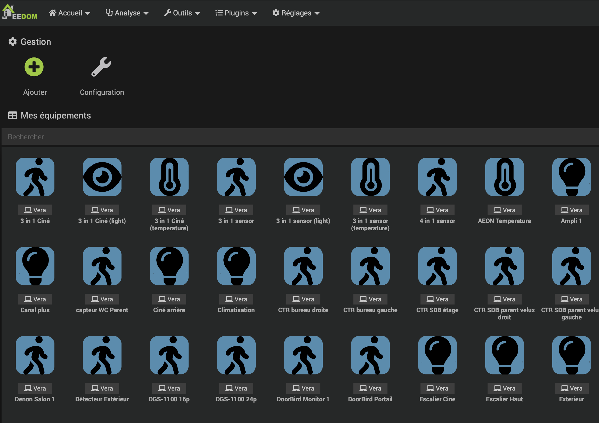
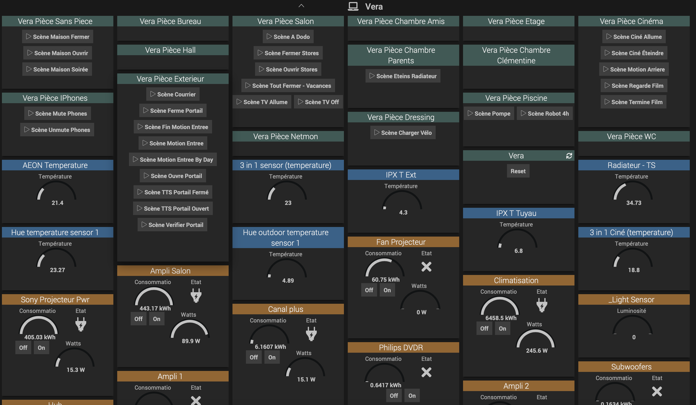

# Plugin Jeedom pour controler une Vera Edge Plus Secure ( Micasaverde )

Ce plugin permet de detecter les pieces et les scenes d'un controlleur **Vera** et de rendre accessible depuis **Jeedom**. il permet de controler certains peripheriques et lancer l'execution des scenes a distance sur la vera. Les commandes respectent les types generiques de jeedom.

Outre les proprietes et les actions de base des périphériques, les mesures d'energies, les consommations, les niveaux de batterie sont remontés dans Vera.

## Utilisation

Le plugin permet de declarer une vera par son addresse IP ce qui creer un equipement de type 'racine'.
- Les pieces de la vera seront detectees et proposees comme un autre equipement dans jeedom. l'utilisateur pourra choisir quels equipements ( les pieces ) il active et rend visibles dans jeedom.

- Les equipements de la vera sont crées comme des equipements sous Jeedom avec les commandes correspondantes pour les actions et les variables de status principales. 

- Si la piece de la vera comporte une scene,  une action est cree sur l'equipement piece. cette action permet de declencher la scene sur la vera.

Les equipements de type pieces et les peripheriques associés suivront toujours l'equipement racine ( la vera ). 
* Si l'equipement vera est detruit, les pieces associées et les peripheriques associés seronts detruites.
* Si l'equipement vera est deplacé dans un autre objet parent jeedom, les pieces et les peripheriques associés seront deplacees dans le meme objet parent.
* La liste des equipements peut etre resynchronisé avec la liste des equipements sur la vera grace a la commande 'reset' sur l'equipement racine vera.

Les 'device type' de peripherique VERA supportés sont:
  - binaryLight 
  - dimmableLight
  - TemperatureSensor
  - LightSensor
  - MotionSensor
  - Humidity Sensor
  - Window Cover
  - Door Sensor

Par defaut, seul l'equipement racine (la vera) est cree en mode actif et visible, tous les autres equipements detectes doivent etre mis actifs et visibles pour etre mis a jour et visible dans le dashboard Jeedom.  Il est recommandé de passer par le menu Analyse / Resumé domotique.

## Commandes

le plugin fait une configuration par defaut mais qui peut etre changée par l'utilisateur une fois que l'equipement et les commandes ont ete créés. 

- les types generiques correspondants sont configures sur les commandes
- les commandes de type Watts / KWH sont affichees par default ( changeable apres coup par l'utilisateur )
- les commandes de type Batterie ne sont pas affichees par default mais bien présentes et visible dans la page Jeedom (Analyze / Equipement). L'utilisateur peut choisir de rendre la commande 'batterie' dans le dashboard s'il le souhaite

## Change Log

[Change Log](changelog.md)

## Installation

au debut il faut commencer par ajouter le plugin. pour le moment a travers github avec la branche master ou beta

puis il faut l'activer dans jeedom

dans la configuration du plugin, il faut configurer la frequence du refresh des donnees de la vera. 10s semble etre une bonne valeur.

il faut creer un nouvelle equipement qui represente votre vera. pour cela on creer un equipement, on choisi un objet parent auquel le rattacher, puis on renseigne l'addresse IP de la vera

a la sauvegarde, il faut etre patient. le plugin communique avec la vera et va creer des equipements pour les pieces de la vera avec des commandes pour lancer les scenes qui sont dans ces pieces. le plugin va aussi creer des equipements pour les objets de type BinaryLight avec des commandes ETAT, ON et OFF. tout cela prend un petit de temps, mais si tout ce passe bien vous obtiendrer une liste d'equipement comme ceci. c'est alors votre choix de decider quel equipement rendre actif et visible pour qu'il soit fonctionel et visible sur le dashboard de jeedom

Une fois que tout est fait, le dashboard de la vera ressemblera, par defaut a ceci.

Les equipements a pile sont reportés dans jeedom Analyse/Equipements.

Les commandes on / off des equipements binaryswitch sont proposées avec le widget binarySwitch de jeedom.

